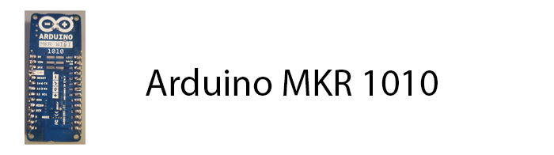
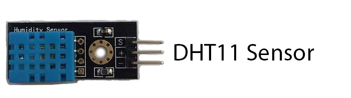

# Cluecon 2021 Arduino Challenge 5
Using an Arduino board, create a micoro weather station, and set params to make it trigger a phone call or text weather report.

## About Cluecon 2021 Arduino Challenge 5
For this challenge you will demonstrate your technical skills to send and receive a call and sms message using an Arduino.

Our examples will show you how to test the resistance, and temperature or water. However, feel free to go further, and test other factors related to purity.

## Getting Started
- [x] Arduino IDE
- [x] Putty or Similar for opening serial port
- [x] Arduino MKR WiFi 1010 or Similar
- [x] Micro USB Cable
- [x] Temperature & Humidity Sensor

## Cluecon 2021 Arduino Challenge 5 - How It Works
We demostrate how to connect to a WiFi Access Point, Create Simple Web Server to handle requests, and a simple HttpClient to comunication with SignalWire REST Api.

## Let's Get Started 
Prepare Your Coding Enviroment
1. Install Arduio IDE 
- [Installing Arduino IDE](https://www.arduino.cc/en/guide/windows)
2. Then open and goto Tools -> Boards -> Boards Manager
3. Type in 'MKR' and make sure that 'Arduino SAMD Boards (32-bits ARM Cortex-M0+)' is Installed, If not click install

4. Take inventory and prepare your sensors for what you need
5. Code! - There are examples included, to get you started, and we are here to help.

# More Documentation
You can find more documentation on LaML, Relay, and all Signalwire APIs at:
- [SignalWire API Docs](https://docs.signalwire.com)
- [SignalWire Github](https://gituhb.com/signalwire)
- [Arduino IDE](https://www.arduino.cc/en/guide/windows)
- [PuTTY Client](https://www.chiark.greenend.org.uk/~sgtatham/putty/latest.html)

# Support
If you have any issues or want to engage further about this Signal, please [open an issue on this repo](../../issues) or join our fantastic [Slack community](https://signalwire.community) and chat with others in the SignalWire community!

If you need assistance or support with your SignalWire services please file a support ticket from your Dashboard. 

